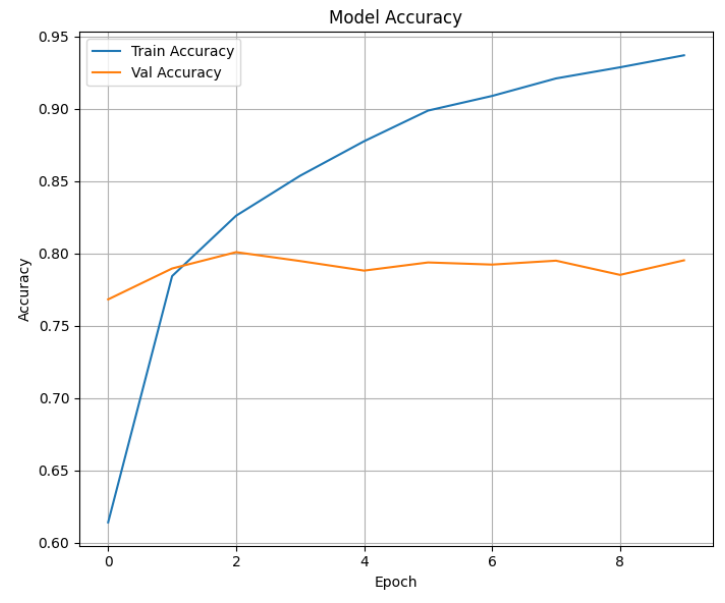

# Dog Breed Classification with MobileNetV2 🐶

This project performs image classification on the Stanford Dogs Dataset using MobileNetV2, a lightweight and efficient convolutional neural network architecture.

## 📁 Dataset

The dataset used is the [Stanford Dogs Dataset](http://vision.stanford.edu/aditya86/ImageNetDogs/).  
Before running the notebook, please **download the dataset manually** from the above link and place it in the following structure:

```
dataset/
└── images/
    └── Images/
        ├── n02085620-Chihuahua/
        │   ├── image1.jpg
        │   ├── image2.jpg
        │   └── ...
        └── ...
```

## 🧠 Model

We use a pretrained MobileNetV2 model with the final layers customized for the number of dog breeds in the dataset. The model is fine-tuned using Keras and TensorFlow.

## 📊 Training Results

The model is trained for 10 epochs. Accuracy and loss over epochs are shown below:

### Accuracy Plot



### Loss Plot


## 📄 License

This project is licensed under the MIT License.
